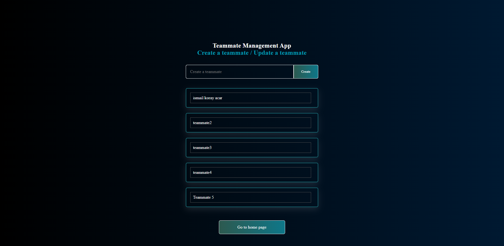
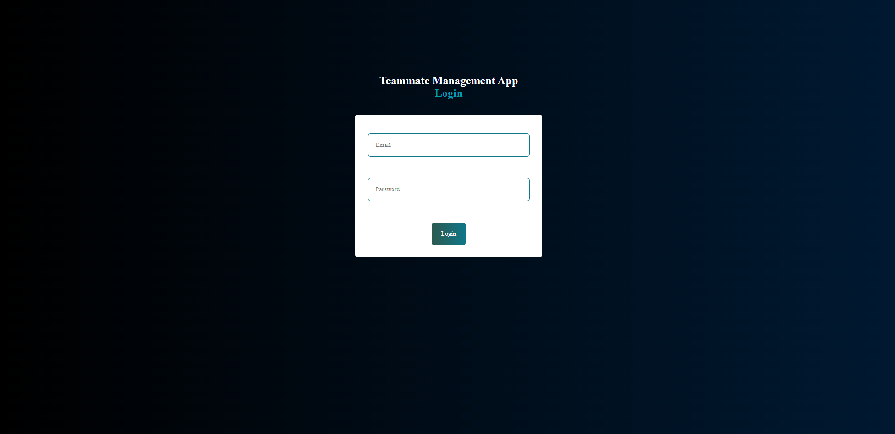
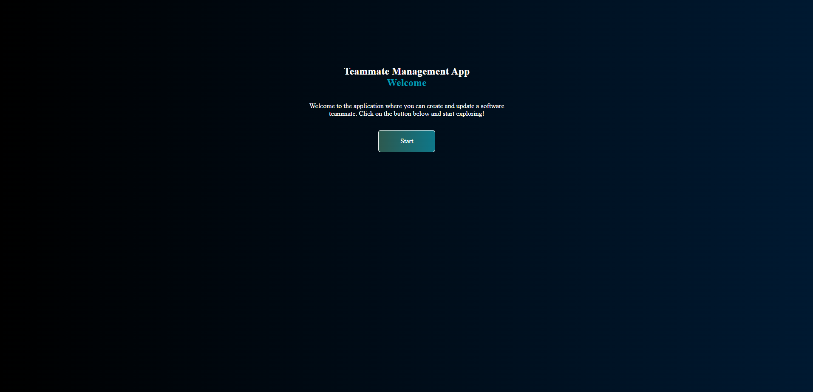

# Teammate Management TypeScript App

Get quickly started with TypeScript by building a Teammate Management App.
This project is built using [TypeScript and React](https://create-react-app.dev/docs/adding-typescript/)

## Available Scripts

In the project directory, you can run:

### `npm install`

To install dev dependencies.

Start JSON Server:

### `npm run server`

Run the project

### `npm start`

